# ITNETWORK - ZÁVĚREČNÝ PROJEKT (INSURANCEAPP)

V tomto repozitáři naleznete **ZÁVEREČNÝ PROJEKT (Evidence pojištění - Zjednodušená verze)** k rekvalifikačnímu kurzu **Programátor www aplikací v JavaScript** od společnosti [ITNetwork.cz](https://www.itnetwork.cz/prace-a-podnikani-v-it/rekvalifikacni-kurzy).

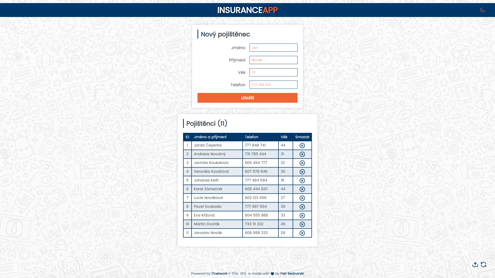

## Obsah

- [Přehled](#přehled)
  - [Zadání projektu 📋](#zadani)
  - [Náhled 👀](#nahled)
  - [Odkaz LIVE ➡🌍⬅](#odkaz)
- [Můj proces](#muj-proces)
  - [Popis 📃](#popis)
  - [Funkcionality ✨](#funkcionality)
- [Autor 🙋‍♂️](#autor)

## Přehled

### Zadani 
**Webová aplikace (JavaScript, PHP)**

Naprogramuj webovou aplikaci pro evidenci pojistných událostí.

  **Minimální požadavky ke splnění**
  - Aplikace obsahuje správu **pojištěných** (to jsou pojištěné osoby, např. "Jan Novák"):
    - Vytvoření pojištěného
      - Evidujte jméno, příjmení, věk a telefonní číslo
    - Zobrazení seznamu všech pojištěných
  - Dané entity jsou uloženy v kolekci v paměti (JS) nebo v databázi (PHP)
  - Aplikaci lze pro zjednodušení vytvořit celou jen na jedné stránce
  - Aplikace je naprogramována podle dobrých praktik

  **Dobré praktiky**
  - Oddělujte kód do samostatných tříd a souborů
  
**JavaScript**
  - Využívejte konstruktory pro inicializaci objektů
  - `toString()` pro jejich výpis

### Nahled
#### Desktopový náhled - Světlý motiv 🖥

#### Desktopový náhled - Tmavý motiv 🖥
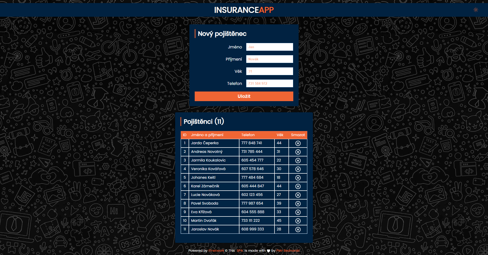

#### Mobilní náhled 📱
<table>
  <tr>
    <td>Světlý motiv</td>
    <td>Tmavý motiv</td>
  </tr>
  <tr>
    <td>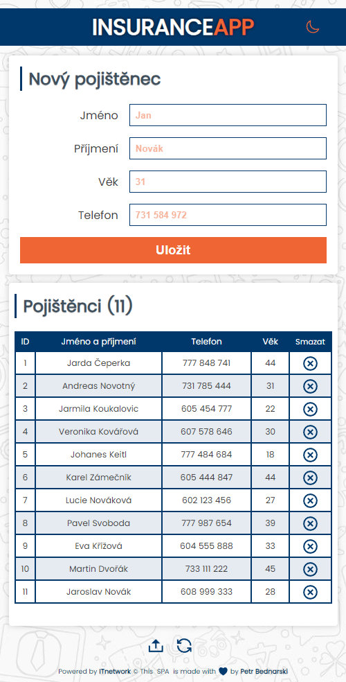</td>
    <td>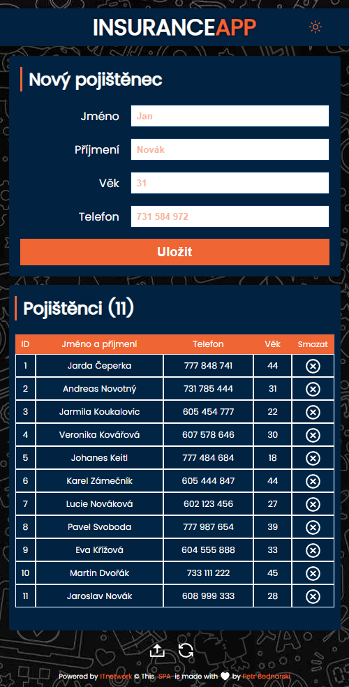</td>
  </tr>
</table>

### Odkaz
  
  
# ➡ [Projekt ŽIVĚ k vyzkoušení](https://funny-salmiakki-9acd9f.netlify.app/) ⬅

    
## Muj proces
 

### Popis

- Projekt spočívá v tom, že zobrazuje a přidává jednotlivé záznamy pocházející z vyplněného **formuláře** v horní oblasti stránky do **tabulky** ve spodní části stránky.
- Při vyplnění jednotlivých políček formuláře a kliknutí na tlačítko `Uložit` se vyplněné záznamy (jsou-li správně) vypíší do jednotlivch řádků tabulky.
- Celý projekt se skládá z hlavního souboru `index.html` a složky `assets`, ve které jsou roztříděné všechny dodatečné soubory v podsložkách (CSS styly, obrázky pro projekt, screeny projektu, JavaScript soubory).
- JavaScript využívá metodu **Objektově orientovaného programování** a je poskládán ze 3 souborů (`Client.js`, `InsuranceApp.js`, `index.js`).
- Je-li formulář správně vyplněný, ukládají se tyto data pole s názvem `clients` a do paměti prohlížeče `localStorage`. Při načtění stránky se kontroluje pamět localStorage a jsou-li zde nějaká data, zobrazí se v tabulce.
- Z velké části tento projekt vychází ze základů logiky cvičení v [OOP - Lekce 5 - Tvorba OOP diáře v JavaScriptu](https://www.itnetwork.cz/javascript/oop/tvorba-oop-diare-v-javascriptu).
- Design stránky byl záměrně inspirován designem stránky [ITnetwork.cz](https://www.itnetwork.cz/), pozadí zase aplikací **Whatsapp**.

### Funkcionality 

#### 1) Přepínání na tmavý/svělý design
Kliknutím na tlačítko **měsíce** v horní liště nadpisu (v pravném rohu stránky), se v JavaScriptu přidá k určitým elementům na stráce `CSS třída`, která má jiné vizuální vlastnosti a tím se docílí se prolnutí do **tmavého režimu**. Opětovným kliknutím na již změněnou ikonku **měsíce/slunce**, se třída odstraní a docílí se původního (svělého) motivu. Přechod je plynulý a nastavuje se paramterem `--theme-time` v CSS stylech (aktuálně trvá 0.85s).   

-----

#### 2) Formulář - ošetření vstupů uživatele
Jednotlivé textové vstupy od uživatele jsou při kliknutí na tlačítko **Uložit** kontrolovány náslědovně:

- Pole **Jméno** musí obsahovat alespoň **2 znaky**
- Pole **Příjmení** musí obsahovat alespoň **2 znaky**
- Pole **Věk** musí být **číslice** v rozmezí **0** až **169** *(na Zemi nebylo dokázáno delší lidské dožití :) )* 
- Pole **Telefon** musí být zadán ve formátu `ABC DEF GHI`, `ABCDEFGHI`, `+420 ABC DEF GHI`, `+420ABCDEFGHI` - v každém případě se do tabulky zapisuje pouze formát `ABC DEF GHI` (smaže se případná předvolba)

Pokud některé pole při kliknutí na tlačítko formuláře nesplňuje požadavek, zabarví se rámeček `červeně` a zobrazí se daná hláška, upozorňující uživatele na chybu.  
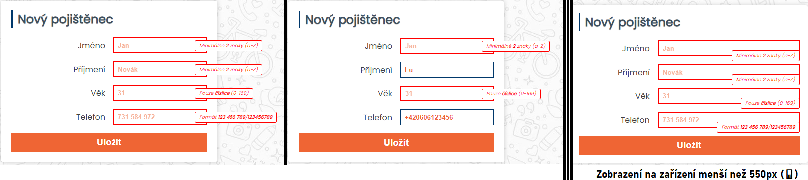

-----

#### 3) Tabulka - zobrazení počtu pojištěnců

V nadpise tabulky `Pojištěnci (?)` se zobrazuje aktuální počet pojištěnců *(hodnota je délka pole clients)*  
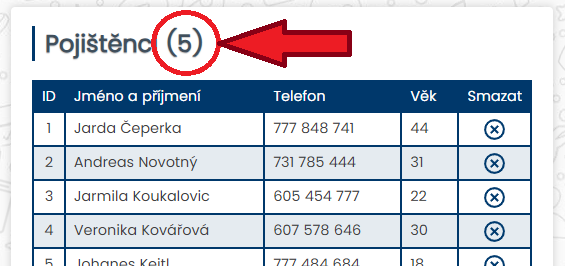

-----

#### 4) Tabulka - sloupec ID pojištěnců
Při každém záznamu se čísluje záznam hodnout `ID`, která je jako první sloupec v tabulce. Je-li záznam smazán, počítá číslování i s tímto smazaným záznamem. ID je unikátní pro každý záznam *(řádek)*.    
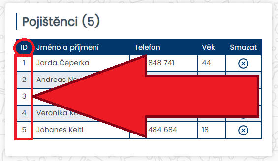

-----

#### 5) Tabulka - mazání záznamu
Poslední sloupec tabulky obsahuje tlačíko `zakroužkované X`. Při kliknutí na toto tlačítko u daného záznamu se jednotlivý řádek smaže a záznam se odstraní z pole `clients`.    
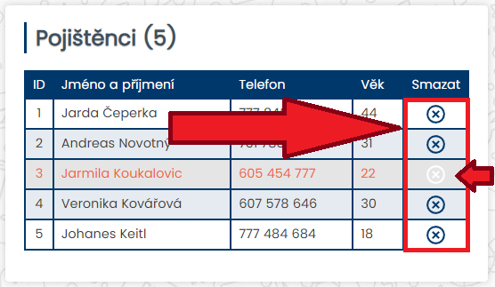

-----

#### 6) Tabulka - řazení záznamů (A -> Z, 0 -> 99)
Při kliknutí na **název sloupce** v hlavičce tabulky (*ID*, *Jméno*, *Příjmení*, *Věk*, *Číslo*) se záznamy seřadí podle daného sloupce *(řazení je pouze vzestupně)*. Pokud je nějaké řazení aktivní, zabarví se text jinou barvou. Výchozí řazení je dle **ID**. Řadí i telefonní čísla, neřadí sloupec **Smazat**. Záměrně není nastaven **kurzor na pointer**.   
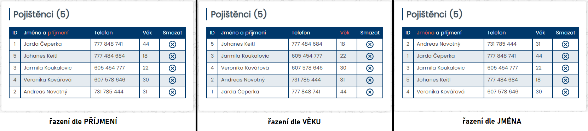

-----

#### 7) Tabulka - žádný záznam
Pokud se v tabulce nevyskytuje žádný záznam, nebo byl poslední zázna smazán - zobrazí se hláška **Zatím tady není žádný pojištěnec**.  
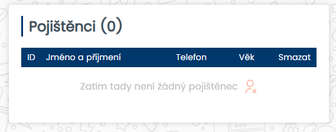

-----

#### 8) Ovládací tlačítka - loadDataButton
Ve spodní pravé části obrazovky *(případně pod tabulkou na mobilních zařízeních)* se nacházejí **2 tlačítka (loadDataButton, flushButton)**. Tlačítko **loadDataButton** smaže stávající data v tabulce, nahraje *předvyplněná data v JS souboru `InsuranceApp.js`* a vyplní tabulku testovacími údaji  *(tzn. nahraje testovací pole `clients`, uloží pole do paměti `localStorage`)*. 

Při zastavení kurzorem myši se na tlačítku **loadDataButton** se spustí CSS animace, zobrazující hlášku s nápovědou, co toto tlačítko dělá: `Tlačítko pro nahrání testovacích dat`  
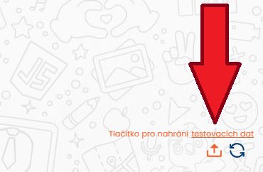
 
**Testovací data:**

<table>
<tr>
<td>ID</td>
<td>Jméno a příjmení</td>
<td>Telefon</td>
<td>Věk</td>
</tr>
<tr>
<td>1</td>
<td>Jarda Čeperka</td>
<td>777 848 741</td>
<td>44</td>
</tr>
<tr>
<td>2</td>
<td>Andreas Novotný</td>
<td>731 785 444</td>
<td>31</td>
</tr>  
<tr>
<td>3</td>
<td>Jarmila Koukalovic</td>
<td>605 454 777</td>
<td>22</td>
</tr>
<tr>
<td>4</td>
<td>Veronika Kovářová</td>
<td>607 578 646</td>
<td>30</td>
</tr>
<tr>
<td>5</td>
<td>Johanes Keitl</td>
<td>777 484 684</td>
<td>18</td>
</tr>
<tr>
<td>6</td>
<td>Karel Zámečník</td>
<td>605 444 847</td>
<td>44</td>
</tr>
<tr>
<td>7</td>
<td>Lucie Nováková</td>
<td>602 123 456</td>
<td>27</td>
</tr>
<tr>
<td>8</td>
<td>Pavel Svoboda</td>
<td>777 987 654</td>
<td>39</td>
</tr>
<tr>
<td>9</td>
<td>Eva Křížová</td>
<td>604 555 888</td>
<td>33</td>
</tr>
<tr>
<td>10</td>
<td>Martin Dvořák</td>
<td>733 111 222</td>
<td>45</td>
</tr>
<tr>
<td>11</td>
<td>Jaroslav Novák</td>
<td>608 999 333</td>
<td>28</td>
</tr>
</table>   	    	

-----

#### 9) Ovládací tlačítka - flushButton
Ve spodní pravé části obrazovky *(případně pod tabulkou na mobilních zařízeních)* se nacházejí **2 tlačítka (loadDataButton, flushButton)**. Tlačítko **flushButton** smaže celou tabulku *(tzn. vymaže pole `clients`, smaže paměť `localStorage`, refreshuje stránku)*. 

Při zastavení kurzorem myši se na tlačítku **flushButton** se spustí CSS animace, zobrazující hlášku s nápovědou, co toto tlačítko dělá: `Tlačítko pro restart dat`
  
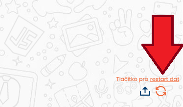

-----

## Autor 

- Website - [GitHub](https://github.com/pettik)
- Frontend Mentor - [@pettik](https://www.frontendmentor.io/profile/pettik)
- ITNetwork - [@Petr Bednarski](https://www.itnetwork.cz/portfolio/41117)

© 2023

